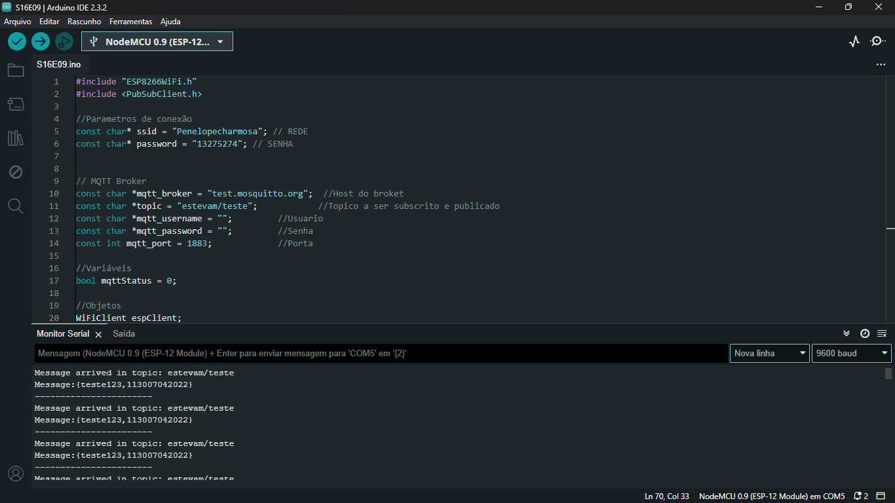

# Projeto de Comunicação MQTT com Arduino GIGA R1 WIFI

Este é um projeto simples que demonstra como usar um Arduino para se comunicar através do protocolo MQTT, publicando mensagens em um tópico específico e subscrevendo a esse tópico para receber mensagens.

## Configuração do Ambiente

### Requisitos de Hardware

- Arduino
- Conexão com uma rede Wi-Fi

### Requisitos de Software

- Arduino IDE
- Biblioteca PubSubClient para Arduino
- MQTTBox (ou outro cliente MQTT)

## Configuração do Código

* Lembrando que esse código é o início do projeto



* Código no esp8266

```ino
#include "ESP8266WiFi.h"
#include <PubSubClient.h>

// Parâmetros de conexão
const char* ssid = "Penelopecharmosa"; // REDE
const char* password = "13275274";     // SENHA

// Broker MQTT
const char *mqtt_broker = "test.mosquitto.org";  // Host do broker
const char *topic = "estevam/teste";            // Tópico a ser subscrito e publicado
const char *mqtt_username = "";                 // Usuário
const char *mqtt_password = "";                 // Senha
const int mqtt_port = 1883;                     // Porta

// Pino do relé
const int relayPin = D1; // Pino do ESP8266 conectado ao relé

// Objetos
WiFiClient espClient;
PubSubClient client(espClient);

// Estado do relé
bool relayState = false; // Estado inicial do relé (desligado)

// Protótipos
bool connectMQTT();
void callback(char *topic, byte * payload, unsigned int length);
void toggleRelay(bool newState);

void setup(void)
{
  Serial.begin(9600);

  // Configurar o pino do relé como saída
  pinMode(relayPin, OUTPUT);

  // Desligar o relé inicialmente
  digitalWrite(relayPin, LOW);

  // Conectar à rede Wi-Fi
  WiFi.begin(ssid, password);

  // Aguardar a conexão
  Serial.println();
  Serial.print("Conectando");
  while (WiFi.status() != WL_CONNECTED) {
    delay(500);
    Serial.print(".");
  }
  Serial.println("");
  Serial.println("WiFi connected");

  // Enviar IP através da UART
  Serial.println(WiFi.localIP());

  // Conectar ao broker MQTT
  if (connectMQTT()) {
    // Inscrever-se ao tópico para receber comandos
    client.subscribe(topic);
  }
}

void loop() {
  // Verificar se há mensagens recebidas
  client.loop();
}

bool connectMQTT() {
  byte tentativa = 0;
  client.setServer(mqtt_broker, mqtt_port);
  client.setCallback(callback);

  do {
    String client_id = "BOBSIEN-";
    client_id += String(WiFi.macAddress());

    if (client.connect(client_id.c_str(), mqtt_username, mqtt_password)) {
      Serial.println("Conexão bem-sucedida:");
      Serial.printf("Cliente %s conectado ao broker\n", client_id.c_str());
      return true;
    } else {
      Serial.print("Falha ao conectar: ");
      Serial.print(client.state());
      Serial.println();
      Serial.print("Tentativa: ");
      Serial.println(tentativa);
      delay(2000);
    }
    tentativa++;
  } while (!client.connected() && tentativa < 5);

  Serial.println("Não foi possível conectar ao broker MQTT");
  return false;
}

void callback(char* topic, byte* payload, unsigned int length) {
  Serial.print("Mensagem recebida no tópico: ");
  Serial.println(topic);

  // Converter o payload para uma string
  String message = "";
  for (int i = 0; i < length; i++) {
    message += (char)payload[i];
  }

  Serial.print("Mensagem: ");
  Serial.println(message);

  // Verificar se a mensagem é para ligar ou desligar o relé
  if (message == "ligar") {
    // Verificar se o relé já está ligado
    if (!relayState) {
      toggleRelay(true); // Ligar o relé
    }
  } else if (message == "desligar") {
    // Verificar se o relé já está desligado
    if (relayState) {
      toggleRelay(false); // Desligar o relé
    }
  }
}

void toggleRelay(bool newState) {
  // Atualizar o estado do relé
  relayState = newState;

  // Atualizar o estado do pino do relé
  digitalWrite(relayPin, newState ? HIGH : LOW);

  // Enviar o estado atual do relé para o tópico MQTT
  client.publish(topic, newState ? "ligado" : "desligado");
}
```

* Código no arduino Giga R1 Wi-Fi

```ino
#include <WiFi.h>
#include <PubSubClient.h>

// Parametros de conexão
const char* ssid = "Penelopecharmosa"; // REDE
const char* password = "13275274";     // SENHA

// MQTT Broker
const char *mqtt_broker = "test.mosquitto.org";  // Host do broker
const char *topic = "estevam/teste";            // Tópico a ser subscrito e publicado
const char *mqtt_username = "";                 // Usuário
const char *mqtt_password = "";                 // Senha
const int mqtt_port = 1883;                     // Porta

// Pino do relé
const int relayPin = 52; // Use o pino correto para o relé

// Variáveis
bool mqttStatus = false;
bool relayState = false; // Estado inicial do relé (desligado)

// Objetos
WiFiClient wifiClient;
PubSubClient client(wifiClient);

// Protótipos
bool connectMQTT();
void callback(char* topic, byte* payload, unsigned int length);
void toggleRelay(bool state);

void setup() {
  Serial.begin(9600);

  // Inicialização da conexão WiFi
  WiFi.begin(ssid, password);
  while (WiFi.status() != WL_CONNECTED) {
    Serial.print(".");
    delay(1000);
  }
  Serial.println("Conectado à rede WiFi!");

  // Inicialização da conexão MQTT
  client.setServer(mqtt_broker, mqtt_port);
  client.setCallback(callback);
  mqttStatus = connectMQTT();

  // Configuração do pino do relé
  pinMode(relayPin, OUTPUT);
  digitalWrite(relayPin, LOW); // Desliga o relé inicialmente
}

void loop() {
  if (mqttStatus) {
    if (!client.connected()) {
      connectMQTT();
    }
    client.loop();
  }
}

bool connectMQTT() {
  byte tentativa = 0;
  while (!client.connected() && tentativa < 5) {
    if (client.connect("arduinoClient", mqtt_username, mqtt_password)) {
      Serial.println("Conexão bem-sucedida ao broker MQTT!");
      client.subscribe(topic);
      return true;
    }
    else {
      Serial.print("Falha ao conectar: ");
      Serial.println(client.state());
      Serial.print("Tentativa: ");
      Serial.println(tentativa);
      delay(2000);
      tentativa++;
    }
  }
  Serial.println("Não foi possível conectar ao broker MQTT");
  return false;
}

void callback(char* topic, byte* payload, unsigned int length) {
  Serial.print("Mensagem recebida no tópico: ");
  Serial.println(topic);

  String message = "";
  for (int i = 0; i < length; i++) {
    message += (char)payload[i];
  }

  Serial.print("Mensagem: ");
  Serial.println(message);

  if (message.equals("ligar")) {
    toggleRelay(true);
  }
  else if (message.equals("desligar")) {
    toggleRelay(false);
  }
}

void toggleRelay(bool state) {
  relayState = state;
  digitalWrite(relayPin, state ? HIGH : LOW);
  client.publish(topic, state ? "ligado" : "desligado");
}
```

1. Defina os parâmetros de conexão Wi-Fi e MQTT no código:
   - SSID e senha da rede Wi-Fi (`ssid` e `password`)
   - Endereço do broker MQTT (`mqtt_broker`)
   - Tópico MQTT a ser usado (`topic`)
   - Nome de usuário e senha do broker MQTT, se necessário (`mqtt_username` e `mqtt_password`)
   - Porta MQTT (geralmente é 1883) (`mqtt_port`)

2. Compile e envie o código para o ESP8266 usando a Arduino IDE.

## Configurando o Mosquitto e Usando `mosquitto_sub`

Este guia mostrará como configurar e utilizar o Mosquitto, um broker MQTT de código aberto, e como usar a ferramenta `mosquitto_sub` para se inscrever em um tópico MQTT.

### Instalação do Mosquitto

1. Baixe e instale o Mosquitto de acordo com as instruções disponíveis em [mosquitto.org](https://mosquitto.org/download/).

2. Após a instalação, abra a pasta do Mosquitto.


### Inicializando o Servidor Mosquitto

1. Abra um terminal na pasta do Mosquitto.

2. Inicie o servidor Mosquitto executando o seguinte comando:
```bash
mosquitto -c mosquitto.conf
```

Certifique-se de que o arquivo de configuração `mosquitto.conf` esteja presente na pasta e configurado conforme necessário.

### Utilizando `mosquitto_sub`


1. Abra um novo terminal na pasta do Mosquitto. 
2. Execute o comando `mosquitto_sub` para se inscrever em um tópico MQTT:

```bash
.\mosquitto_sub.exe -h localhost -t estevam/teste
```
- `-h localhost`: Especifica o host do broker MQTT (neste caso, localhost). 
- `-t estevam/teste`: Especifica o tópico MQTT ao qual você deseja se inscrever.

Substitua `estevam/teste` pelo tópico MQTT desejado. 
3. O `mosquitto_sub` agora está ouvindo por mensagens publicadas no tópico especificado.
### Recebendo Mensagens MQTT

Quando uma mensagem é publicada no tópico `estevam/teste`, ela será exibida no terminal onde o `mosquitto_sub` está sendo executado. Você verá as mensagens MQTT conforme elas são recebidas.

Certifique-se de manter o terminal do `mosquitto_sub` aberto para continuar ouvindo por novas mensagens.

## Configuração do MQTTBox


1. Abra o MQTTBox.

2. Configure um novo cliente MQTT:
   - Nome do Cliente MQTT: Escolha um nome significativo (por exemplo, "Cafeteira IoT").
   - Protocolo: MQTT/TCP.
   - Nome de usuário e senha, se necessário, de acordo com as configurações do seu broker.
   - Host: Endereço do seu broker MQTT (por exemplo, "localhost:1883").


3. Insira a mensagem a ser publicada:
   - Topic to publish: Insira o mesmo tópico que foi definido no código (por exemplo, "estevam/teste").
   - Payload: Insira a mensagem que deseja enviar.

4. Comece a ouvir as mensagens publicadas no tópico.

## Execução do Projeto

1. Inicie o MQTTBox e configure-o conforme descrito acima.

2. Inicie o mosquitto_sub no terminal para se inscrever no mesmo tópico:

```perl
.\mosquitto_sub.exe -h localhost -t estevam/teste
```

3. O ESP8266 publicará mensagens no tópico especificado em intervalos regulares, conforme definido no código.

4. As mensagens publicadas pelo ESP8266 serão exibidas tanto no MQTTBox quanto no mosquitto_sub, demonstrando a comunicação bem-sucedida.

## Funcionamento do Código

- O código conecta-se à rede Wi-Fi e, em seguida, ao broker MQTT.
- Após a conexão bem-sucedida, o código publica mensagens no tópico especificado em intervalos regulares (1 segundo).
- Ele também se inscreve no mesmo tópico para receber mensagens, embora no exemplo fornecido não haja nenhuma ação específica quando uma mensagem é recebida.

## ligando a cafeteira:

- Agora que a conexão foi bem-sucedida e o cliente MQTT está conectado ao broker, você pode usar o MQTTBox ou outro cliente MQTT para enviar mensagens para o tópico "estevam/teste" e controlar o relé, que por sua vez controla a cafeteira elétrica.

Para ligar a cafeteira, você precisa enviar a mensagem "ligar" para o tópico MQTT "estevam/teste". E para desligar, envie a mensagem "desligar" para o mesmo tópico.

Aqui está um resumo do que fazer: 
1. Abra o MQTTBox. 
2. Configure um novo cliente MQTT conforme descrito anteriormente. 
3. No campo "Topic to publish", insira "estevam/teste". 
4. No campo "Payload", insira "ligar" (para ligar a cafeteira) ou "desligar" (para desligar a cafeteira). 
5. Clique no botão "Publish" para enviar a mensagem.

Após o envio da mensagem, o ESP8266 irá recebê-la e, dependendo do conteúdo (ligar ou desligar), irá controlar o relé que, por sua vez, irá ligar ou desligar a cafeteira elétrica.

Certifique-se de que a cafeteira está conectada ao relé e que você está operando com segurança, evitando qualquer risco de choque elétrico.

## Testar no client do navegador

https://testclient-cloud.mqtt.cool/

# Utilizando um Broker Cloud:

* Site: `https://www.emqx.com/en/mqtt/public-mqtt5-broker`

http://www.emqx.io/online-mqtt-client#/recent_connections/31923e3f-de96-490a-bd1d-74450aeeea11

* A forma de conexão com dados no Broker são os mesmos, só muda os dados

* `Name`: `Cafeteira IoT`
* `Client ID`: `mqttx_d544c2bf`
* `Host`: `ws:// broker.emqx.io`
* `Port`: `8083`
* `Path`: `/mqtt`
* `Username`: `estevam`
* `Password`: `user`
* `topic`: `grupo5/cafeteira`
* `QoS`: `0 At most once`

* Mas se for fazer localmente com o software do emqx, o código abaixo é uma boa implementação

```ino
#include <WiFi.h>
#include <PubSubClient.h>

// Parametros de conexão
const char* ssid = "Penelopecharmosa"; // REDE
const char* password = "13275274";     // SENHA

// MQTT Broker
const char *mqtt_broker = "test.mosquitto.org";  // Host do broker
const char *topic = "grupo5/cafeteira";            // Tópico a ser subscrito e publicado
const char *mqtt_username = "";                 // Usuário
const char *mqtt_password = "";                 // Senha
const int mqtt_port = 1883;                     // Porta

// Pino do relé
const int relayPin = 52; // Use o pino correto para o relé

// Variáveis
bool mqttStatus = false;
bool relayState = false; // Estado inicial do relé (desligado)

// Objetos
WiFiClient wifiClient;
PubSubClient client(wifiClient);

// Protótipos
bool connectMQTT();
void callback(char* topic, byte* payload, unsigned int length);
void toggleRelay(bool state);

void setup() {
  Serial.begin(9600);

  // Inicialização da conexão WiFi
  WiFi.begin(ssid, password);
  while (WiFi.status() != WL_CONNECTED) {
    Serial.print(".");
    delay(1000);
  }
  Serial.println("Conectado à rede WiFi!");

  // Inicialização da conexão MQTT
  client.setServer(mqtt_broker, mqtt_port);
  client.setCallback(callback);
  mqttStatus = connectMQTT();

  // Configuração do pino do relé
  pinMode(relayPin, OUTPUT);
  digitalWrite(relayPin, LOW); // Desliga o relé inicialmente
}

void loop() {
  if (mqttStatus) {
    if (!client.connected()) {
      connectMQTT();
    }
    client.loop();
  }
}

bool connectMQTT() {
  byte tentativa = 0;
  while (!client.connected() && tentativa < 5) {
    if (client.connect("arduinoClient", mqtt_username, mqtt_password)) {
      Serial.println("Conexão bem-sucedida ao broker MQTT!");
      client.subscribe(topic);
      return true;
    }
    else {
      Serial.print("Falha ao conectar: ");
      Serial.println(client.state());
      Serial.print("Tentativa: ");
      Serial.println(tentativa);
      delay(2000);
      tentativa++;
    }
  }
  Serial.println("Não foi possível conectar ao broker MQTT");
  return false;
}

void callback(char* topic, byte* payload, unsigned int length) {
  Serial.print("Mensagem recebida no tópico: ");
  Serial.println(topic);

  String message = "";
  for (int i = 0; i < length; i++) {
    message += (char)payload[i];
  }

  Serial.print("Mensagem: ");
  Serial.println(message);

  if (message.equals("ligar")) {
    toggleRelay(false);
  }
  else if (message.equals("desligar")) {
    toggleRelay(true);
  }
}

void toggleRelay(bool state) {
  relayState = state;
  digitalWrite(relayPin, state ? HIGH : LOW);
  client.publish(topic, state ? "ligado" : "desligado");
}
```

## Utilizando agora o MQTT ONE

https://mqtt.one/broker.html

* `server `:`b37.mqtt.one`
* `MQTT Port `:`1883`
* `WebSocket Port `:`8083`
* `User `:`2bqsvw6678`
* `Password `:`0efiqruwxy`
* `Topic `:`2bqsvw6678/estevam`

### Código sem usar o MQTT ONE:

```ino
#include <WiFi.h>
#include <PubSubClient.h>

// Parametros de conexão
const char* ssid = "Penelopecharmosa"; // REDE
const char* password = "13275274";     // SENHA

// MQTT Broker
const char *mqtt_broker = "test.mosquitto.org";  // Host do broker
const char *topic = "grupo5/cafeteira";            // Tópico a ser subscrito e publicado
const char *mqtt_username = "";                 // Usuário
const char *mqtt_password = "";                 // Senha
const int mqtt_port = 1883;                     // Porta
```

### Código usando o MQTT ONE:

```ino
#include <WiFi.h>
#include <PubSubClient.h>

// Parametros de conexão
const char* ssid = "Penelopecharmosa"; // REDE
const char* password = "13275274";     // SENHA

// MQTT Broker
const char *mqtt_broker = "b37.mqtt.one";  // Host do broker
const char *topic = "2bqsvw6678/estevam";            // Tópico a ser subscrito e publicado
const char *mqtt_username = "2bqsvw6678";                 // Usuário
const char *mqtt_password = "0efiqruwxy";                 // Senha
const int mqtt_port = 1883;                     // Porta
```

### Código completo com o MQTT ONE

```ino
#include <WiFi.h>
#include <PubSubClient.h>

// Parametros de conexão
const char* ssid = "Penelopecharmosa"; // REDE
const char* password = "13275274";     // SENHA

// MQTT Broker
const char *mqtt_broker = "b37.mqtt.one";  // Host do broker
const char *topic = "2bqsvw6678/";            // Tópico a ser subscrito e publicado
const char *mqtt_username = "2bqsvw6678";                 // Usuário
const char *mqtt_password = "0efiqruwxy";                 // Senha
const int mqtt_port = 1883;                     // Porta

// Pino do relé
const int relayPin = 52; // Use o pino correto para o relé

// Variáveis
bool mqttStatus = false;
bool relayState = false; // Estado inicial do relé (desligado)

// Objetos
WiFiClient wifiClient;
PubSubClient client(wifiClient);

// Protótipos
bool connectMQTT();
void callback(char* topic, byte* payload, unsigned int length);
void toggleRelay(bool state);

void setup() {
  Serial.begin(9600);

  // Inicialização da conexão WiFi
  WiFi.begin(ssid, password);
  while (WiFi.status() != WL_CONNECTED) {
    Serial.print(".");
    delay(1000);
  }
  Serial.println("Conectado à rede WiFi!");

  // Inicialização da conexão MQTT
  client.setServer(mqtt_broker, mqtt_port);
  client.setCallback(callback);
  mqttStatus = connectMQTT();

  // Configuração do pino do relé
  pinMode(relayPin, OUTPUT);
  digitalWrite(relayPin, LOW); // Desliga o relé inicialmente
}

void loop() {
  if (mqttStatus) {
    if (!client.connected()) {
      connectMQTT();
    }
    client.loop();
  }
}

bool connectMQTT() {
  byte tentativa = 0;
  while (!client.connected() && tentativa < 5) {
    if (client.connect("arduinoClient", mqtt_username, mqtt_password)) {
      Serial.println("Conexão bem-sucedida ao broker MQTT!");
      client.subscribe(topic);
      return true;
    }
    else {
      Serial.print("Falha ao conectar: ");
      Serial.println(client.state());
      Serial.print("Tentativa: ");
      Serial.println(tentativa);
      delay(2000);
      tentativa++;
    }
  }
  Serial.println("Não foi possível conectar ao broker MQTT");
  return false;
}

void callback(char* topic, byte* payload, unsigned int length) {
  Serial.print("Mensagem recebida no tópico: ");
  Serial.println(topic);

  String message = "";
  for (int i = 0; i < length; i++) {
    message += (char)payload[i];
  }

  Serial.print("Mensagem: ");
  Serial.println(message);

  if (message.equals("ligar")) {
    toggleRelay(false);
  }
  else if (message.equals("desligar")) {
    toggleRelay(true);
  }
}

void toggleRelay(bool state) {
  relayState = state;
  digitalWrite(relayPin, state ? HIGH : LOW);
  client.publish(topic, state ? "ligado" : "desligado");
}
```
